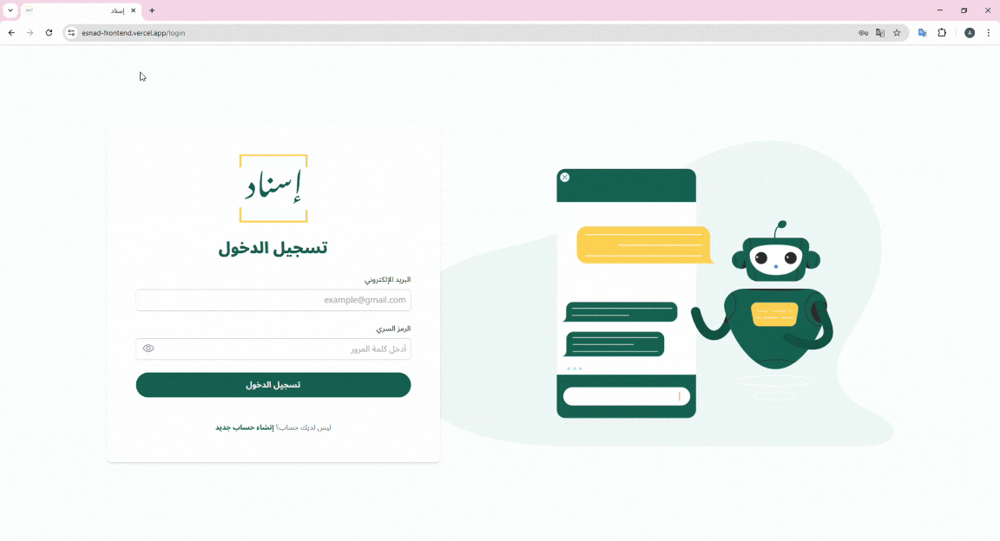

# Esand: Legal Research Assistant
Esnad is a legal research assistant designed to help lawyers work more efficiently. It features a user-friendly chatbot interface that provides case-specific insights, quickly identifies relevant case law, summarizes key precedents, and spots weaknesses in related legal arguments.

## Demo

## Features
- **Relevant Case Laws:** Quickly finds and retrieves case laws related to the given legal query.
- **Precedent Summaries:** Provides concise summaries of important legal precedents to aid in case preparation.
- **User-Friendly Interface:** An intuitive, chat-based search.

## Repositories
This is the backend of the app. Other repos:
- [Frontend](https://github.com/AbeerAlshalawi/esnad-frontend)
- [Model API](https://github.com/Osraj/Masar_Model)

## Tech Stack
**Frontend:** React, Tailwind CSS.  
**Backend:** NestJS, PostgreSQL.  

## Deployment
**Frontend:** Vercel  
**Backend:** AWS EC2  

### AI Model Deployment
Because the model is resource intensive, I couldn’t deploy it on a free-tier cloud service. So I run the model locally and expose it to the internet using [ngrok](https://ngrok.com/) during demos. The app is only fully functional when the model is running.

If you’d like to try the app, you can:
1. Run all three services (frontend, backend, and model API) locally on your machine.  
2. Contact me, and I can temporarily host the model using ngrok.  

## Team
**Product Manager:** Taraf Bin Ghali  
**UI/UX Designer:** Reem Bojeer  
**Software Developer:** Abeer Alshalawi  
**AI Developer:** Osamah Sarraj
